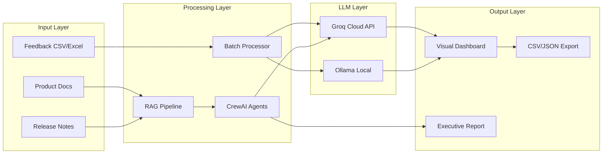
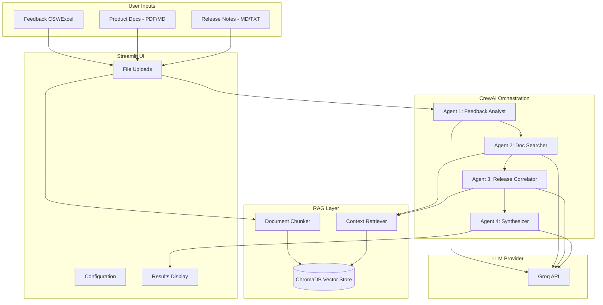
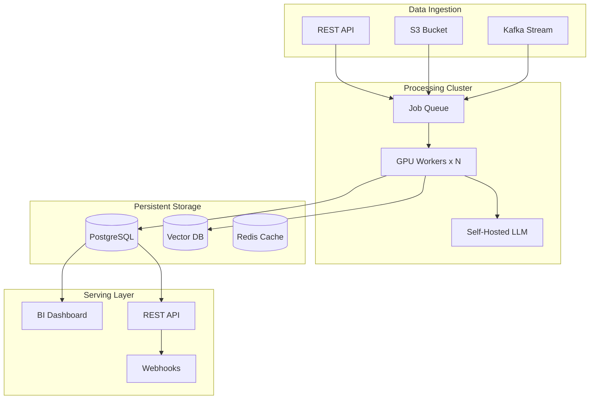

# Customer Feedback Analysis Tool

**AI-powered feedback analysis platform with multi-agent orchestration for actionable product insights.**

Built to demonstrate how modern AI systems can transform unstructured customer feedback into structured, actionable intelligence—going beyond what's possible with manual analysis or simple ChatGPT queries.

---

## The Problem

Product teams drown in customer feedback. App reviews, support tickets, NPS comments, social mentions—thousands of unstructured text inputs that contain critical insights about what users love, hate, and need.

**Traditional approaches fail at scale:**
- Manual analysis is slow and inconsistent
- Keyword searches miss nuance and context
- Generic LLM queries (ChatGPT/Claude) require copy-pasting and produce inconsistent formats

**This tool solves that** by providing a structured, repeatable workflow that:
- Processes thousands of feedback items automatically
- Tags each item with category, sentiment, priority, and summary
- Visualizes patterns for quick decision-making
- Correlates feedback with product releases (multi-agent analysis)
- Exports structured data for downstream tools (Jira, BI dashboards)

---

## Why This Tool vs. ChatGPT/Claude Directly?

| Aspect | ChatGPT/Claude | This Tool |
|--------|---------------|-----------|
| **Bulk Processing** | Copy-paste one at a time | Upload CSV, process thousands |
| **Consistent Output** | Varies between queries | Structured JSON schema every time |
| **Trend Analysis** | Manual comparison | Automated period-over-period |
| **Export Format** | Plain text | CSV, JSON, Markdown reports |
| **Visualization** | None | Interactive dashboards |
| **Reproducibility** | None (different each time) | Same workflow, comparable results |
| **Context Correlation** | Manual | Multi-agent with RAG (docs + releases) |

**The key insight:** LLMs are powerful, but raw chat interfaces aren't optimized for structured, repeatable analytical workflows. This tool wraps LLM capabilities in a product-oriented UX.

---

## System Architecture

### High-Level Data Flow



### Multi-Agent Architecture (CrewAI)

The Root Cause Analysis feature uses a multi-agent system where specialized AI agents collaborate to produce deeper insights:



#### Agent Roles

| Agent | Responsibility | Tools |
|-------|---------------|-------|
| **Feedback Analyst** | Categorize feedback, identify themes, surface critical issues | LLM reasoning |
| **Documentation Specialist** | Search product docs for relevant context, identify documentation gaps | ChromaDB retrieval |
| **Release Correlator** | Cross-reference complaints with release notes, identify regressions | ChromaDB retrieval |
| **Insights Synthesizer** | Combine findings into executive report with prioritized recommendations | LLM reasoning |

---

## Features

### For Product Managers & Operations

- **Executive Dashboard**: Key metrics at a glance—sentiment breakdown, priority distribution, top categories
- **Actionable Recommendations**: AI-generated next steps based on feedback patterns
- **Trend Analysis**: Compare feedback across time periods, spot emerging issues
- **Export to Stakeholders**: Markdown reports suitable for leadership updates

### For Technical Teams

- **Row-Level Tagging**: Each feedback item gets structured metadata (category, sentiment, priority, summary)
- **Filterable Data Table**: Drill down by any tag combination
- **JSON Export**: Structured data ready for Jira integration, database storage, or further analysis
- **Multi-Agent RAG**: Correlate feedback with product documentation and release notes

---

## Performance Optimizations

### Batching & Sampling: Trade-offs Explained

Processing large datasets (10K+ rows) through LLM APIs presents challenges. This tool implements two optimizations:

#### Batch Processing

Instead of one API call per feedback item, we send **15 items per call**.

```
Before: 29,000 rows = 29,000 API calls = ~16 hours (at 30 req/min)
After:  29,000 rows = ~1,966 API calls = ~2-3 hours
```

**Trade-off**: Slight reduction in per-item accuracy (~5-10% on edge cases) because the LLM processes multiple items simultaneously. For statistical analysis and trend detection, this is acceptable.

#### Sampling

For very large datasets, analyze a representative sample instead of all rows.

| Sample Size | API Calls | Time Estimate | Statistical Validity |
|-------------|-----------|---------------|---------------------|
| 500 rows | ~34 | 2-3 min | Good for trends |
| 1,000 rows | ~67 | 4-5 min | Recommended |
| 2,000 rows | ~134 | 8-10 min | High confidence |
| All rows | varies | varies | Maximum accuracy |

**Trade-off**: Sampling introduces variance—you might miss rare edge cases. For most product decisions, a 1,000-row sample provides sufficient signal.

### When to Use What

| Scenario | Recommendation |
|----------|---------------|
| Quick pulse check | 500 sample, batch processing |
| Monthly analysis | 1,000-2,000 sample, batch processing |
| Critical decision | All rows, accept longer processing time |
| Per-ticket routing | Single-row processing (production setup) |

---

## Demo vs. Production Deployment

This repository includes a Streamlit Cloud deployment optimized for demonstration. Production deployments would differ significantly:

| Aspect | Streamlit Cloud (Demo) | Production (AWS/On-Prem) |
|--------|------------------------|--------------------------|
| **LLM** | Groq API (cloud) | Self-hosted Ollama/vLLM on EC2/EKS |
| **Rate Limits** | 30-1000 req/min (Groq tier) | None (your infrastructure) |
| **Batching Required?** | Yes (API constraints) | No (can process row-by-row) |
| **Sampling Required?** | Yes (speed/cost) | No (can process all data) |
| **Vector Store** | In-memory ChromaDB (stateless) | Persistent Pinecone/Weaviate/pgvector |
| **Data Persistence** | None (resets each session) | Database for analysis history |
| **Scaling** | Single Streamlit instance | Horizontal scaling with K8s |
| **Cost Model** | Per-token API pricing | Fixed infrastructure cost |
| **Data Privacy** | Data sent to Groq API | 100% on-prem, data never leaves |

**Key Insight**: The batching and sampling in this demo are **optimizations for API constraints**, not architectural requirements. In a production deployment with self-hosted models (e.g., Llama 3 on AWS GPU instances), you would typically process every row individually for maximum accuracy.

### Production Architecture (Conceptual)



---

## Technical Stack

| Component | Technology | Why |
|-----------|------------|-----|
| **UI Framework** | Streamlit | Rapid prototyping, easy deployment |
| **LLM (Cloud)** | Groq API | Fastest inference (500+ tokens/sec), open-source models |
| **LLM (Local)** | Ollama | Privacy-first, runs on your machine |
| **Agent Framework** | CrewAI | Multi-agent orchestration with role-based agents |
| **Vector Store** | ChromaDB | Open-source, in-memory, Apache 2.0 license |
| **Embeddings** | sentence-transformers | Free, runs locally |
| **Visualization** | Plotly | Interactive charts |
| **Document Parsing** | pypdf | PDF text extraction |

### Supported Models

| Model | Parameters | Speed | Best For |
|-------|------------|-------|----------|
| `llama-3.3-70b-versatile` | 70B | 280 tps | Best quality (recommended) |
| `llama-3.1-8b-instant` | 8B | 560 tps | Fast analysis |
| `openai/gpt-oss-120b` | 120B | 500 tps | Complex reasoning |
| `openai/gpt-oss-20b` | 20B | 1000 tps | Maximum speed |

---

## Getting Started

### Quick Start (Streamlit Cloud)

The app is deployed at: [Your Streamlit Cloud URL]

### Local Setup

```bash
# Clone the repository
git clone https://github.com/OrangeAKA/customerFeebackAnalysis_tool.git
cd customerFeebackAnalysis_tool

# Create environment file
cp .env.example .env
# Edit .env and add your GROQ_API_KEY

# Run setup script
chmod +x setup.sh
./setup.sh
```

### Manual Setup

```bash
python3 -m venv venv
source venv/bin/activate
pip install -r requirements.txt
streamlit run app_llama3v2.py
```

### Configuration

Get your Groq API key at [console.groq.com](https://console.groq.com)

For Streamlit Cloud deployment, add secrets in Settings > Secrets:
```toml
APP_PASSWORD = "your_password"
GROQ_API_KEY = "your_groq_api_key"
```

---

## Project Structure

```
├── app_llama3v2.py           # Main Streamlit application
├── config.py                 # Configuration & secrets loader
├── requirements.txt          # Python dependencies
├── setup.sh                  # Setup and run script
├── agents/                   # CrewAI multi-agent system
│   ├── __init__.py
│   ├── crew_setup.py         # Agent definitions & orchestration
│   ├── tools.py              # ChromaDB retrieval tools
│   └── document_processor.py # PDF/MD parsing & chunking
├── .streamlit/
│   └── secrets.toml.example  # Secrets template
├── deprecated/               # Legacy implementations
│   └── README.md
└── README.md
```

---

## Project Evolution

This project demonstrates iterative product development:

| Phase | Date | What Changed |
|-------|------|--------------|
| **v1.0** | June 2024 | Initial prototype with local Ollama |
| **v2.0** | Feb 2026 | Added Groq cloud support, row-level tagging |
| **v2.1** | Feb 2026 | Visual dashboards, executive summaries |
| **v2.2** | Feb 2026 | Trend analysis across time periods |
| **v2.3** | Feb 2026 | CrewAI multi-agent root cause analysis |
| **v2.4** | Feb 2026 | Batch processing & sampling optimizations |

Each iteration addressed real user needs:
- v1 → "I want to analyze feedback without sending data to OpenAI"
- v2 → "Local models are slow, can I use cloud?"
- v2.1 → "I need visuals for my leadership deck"
- v2.2 → "How do I compare this month vs. last month?"
- v2.3 → "Can it tell me which release caused these complaints?"
- v2.4 → "Processing 30K rows takes forever"

---

## Future Enhancements

Potential next iterations:

- **Jira/Linear Integration**: Auto-create tickets from high-priority feedback
- **Slack Alerts**: Notify channels when sentiment drops
- **Fine-tuned Classifiers**: Train dedicated models for even faster classification
- **Real-time Streaming**: Process feedback as it arrives (Kafka/webhooks)
- **Multi-language Support**: Analyze feedback in any language

---

## License

MIT

---

*Built to demonstrate AI product management skills—understanding trade-offs, system architecture, and user-centric iteration.*
