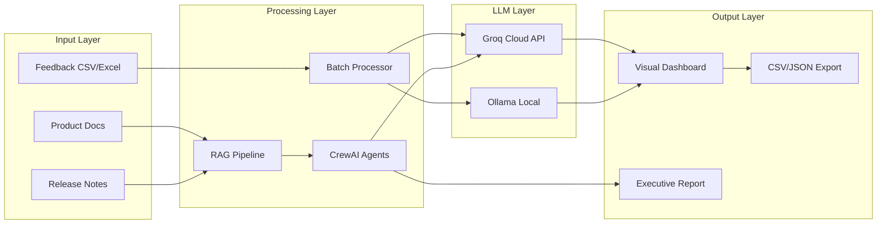
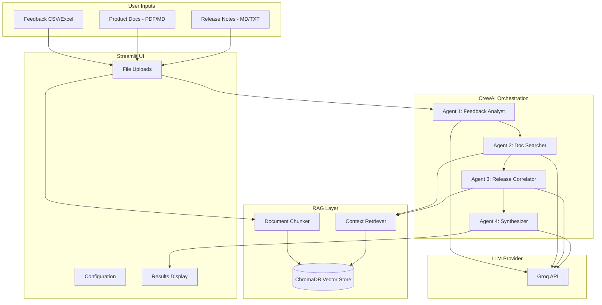
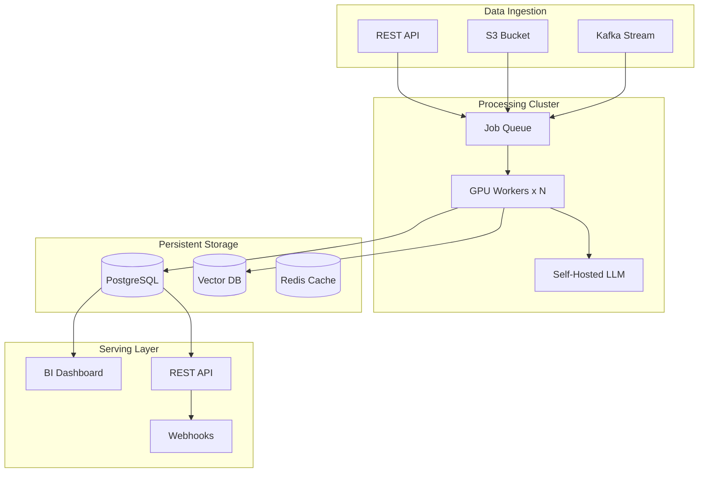

# Customer Feedback Analysis Tool

A tool I built to help product teams make sense of customer feedback at scale. Instead of manually reading through thousands of app reviews, support tickets, and NPS comments, you upload a CSV and get back structured insights with sentiment, categories, and priority tags.

**Try it live:** [akhil-customerfeedbackanalysis-tool.streamlit.app](https://akhil-customerfeedbackanalysis-tool.streamlit.app/)

It will prompt you for a password. If you weren't already given one and want to try it out, DM me on X [@akrishnaakhil](https://x.com/akrishnaakhil).

Started this project in June 2024 when I was frustrated with how long it took to analyze feedback data. Copying and pasting into ChatGPT worked for small batches, but anything over a few hundred items became a nightmare. So I built something better.

---

## What Problem Does This Solve?

Product teams get feedback from everywhere: app stores, support tickets, NPS surveys, social media. Most of it is unstructured text that takes forever to go through manually.

The usual approaches don't scale well:
- Reading everything by hand is slow and you end up inconsistent
- Keyword searches miss context and nuance
- Using ChatGPT or Claude means copy-pasting one item at a time, and you get different output formats every time

With this tool, you upload your feedback file, pick the text column, and it processes everything automatically. Each item gets tagged with category, sentiment, priority, and a one-line summary. You can filter, visualize, and export the results.

---

## How Is This Different From Just Using ChatGPT?

| | ChatGPT/Claude | This Tool |
|---|---|---|
| Bulk Processing | Copy-paste one at a time | Upload CSV, process thousands |
| Output Format | Different every time | Same JSON structure always |
| Trend Comparison | Manual | Automated period-over-period |
| Export | Plain text | CSV, JSON, Markdown reports |
| Visualization | None | Interactive dashboards |
| Reproducibility | Results vary | Same workflow, comparable results |
| Context | Manual | Can correlate with docs and releases |

The point isn't that LLMs aren't good enough. They're great. But a raw chat interface isn't designed for structured, repeatable analysis workflows. This wraps the LLM in a UX that makes sense for the actual job.

---

## Architecture

### How Data Flows Through the System



### Multi-Agent System (CrewAI)

There's also a "Root Cause Analysis" feature that uses multiple AI agents working together. You can upload product docs and release notes, and the agents will try to correlate complaints with specific releases or find documentation gaps.



#### What Each Agent Does

| Agent | Job | Tools |
|---|---|---|
| Feedback Analyst | Categorizes feedback, finds themes, flags critical issues | LLM reasoning |
| Documentation Specialist | Searches product docs for relevant context, spots doc gaps | ChromaDB retrieval |
| Release Correlator | Matches complaints to release notes, identifies regressions | ChromaDB retrieval |
| Insights Synthesizer | Pulls everything together into a report with recommendations | LLM reasoning |

---

## Features

**For PMs and Ops folks:**
- Dashboard with key metrics: sentiment breakdown, priority distribution, top categories
- AI-generated recommendations based on patterns in the feedback
- Trend analysis to compare feedback across time periods
- Markdown exports you can share with leadership

**For technical teams:**
- Every feedback item gets structured metadata (category, sentiment, priority, summary)
- Filterable data table to drill down by any tag
- JSON export for Jira integration, databases, or further analysis
- Multi-agent RAG to correlate feedback with docs and releases

---

## Performance: Batching and Sampling

When I first tested this on a 29K row dataset, it was going to take something like 16 hours. That's because the naive approach is one API call per row, and Groq's free tier has rate limits.

So I added two optimizations:

### Batching

Instead of sending one feedback item per API call, the tool sends 15 at a time. This cuts API calls by roughly 15x.

```
Before: 29,000 rows = 29,000 API calls = ~16 hours
After:  29,000 rows = ~1,966 API calls = 2-3 hours
```

The tradeoff is slightly lower accuracy on edge cases (maybe 5-10%) because the LLM is processing multiple items at once. For trend analysis and statistical insights, this is fine.

### Sampling

For really large datasets, you can analyze a random sample instead of everything.

| Sample Size | API Calls | Time | When to Use |
|---|---|---|---|
| 500 rows | ~34 | 2-3 min | Quick pulse check |
| 1,000 rows | ~67 | 4-5 min | Monthly analysis (recommended) |
| 2,000 rows | ~134 | 8-10 min | Higher confidence |
| All rows | varies | varies | Critical decisions |

The tradeoff is you might miss rare edge cases. But for most product decisions, a 1,000-row sample gives you enough signal.

---

## Demo vs Production: Important Differences

This repo is set up for Streamlit Cloud, which is great for demos but not how you'd run this in production.

| | Streamlit Cloud (Demo) | Production (AWS/On-Prem) |
|---|---|---|
| LLM | Groq API (cloud) | Self-hosted Ollama or vLLM |
| Rate Limits | 30-1000 req/min depending on tier | None, limited only by your hardware |
| Batching Needed? | Yes, because of API constraints | No, can process row by row |
| Sampling Needed? | Yes, for speed and cost | No, can process everything |
| Vector Store | In-memory ChromaDB (resets each session) | Persistent Pinecone/Weaviate/pgvector |
| Data Persistence | None | Database for analysis history |
| Scaling | Single instance | Horizontal scaling with K8s |
| Cost | Per-token API pricing | Fixed infrastructure cost |
| Privacy | Data goes to Groq API | Data never leaves your servers |

**Important**: The batching and sampling are optimizations for API constraints, not architectural requirements. If you deploy this on-prem with self-hosted models (like Llama 3 on AWS GPU instances), you'd probably process every row individually for maximum accuracy.

### What Production Would Look Like



---

## Tech Stack

| Component | Technology | Why I Chose It |
|---|---|---|
| UI | Streamlit | Fast to prototype, easy to deploy |
| LLM (Cloud) | Groq API | Fastest inference I found (500+ tokens/sec), runs open-source models |
| LLM (Local) | Ollama | Privacy-first option, runs on your machine |
| Agent Framework | CrewAI | Good multi-agent orchestration with role-based agents |
| Vector Store | ChromaDB | Open-source, in-memory, Apache 2.0 license |
| Embeddings | sentence-transformers | Free, runs locally |
| Charts | Plotly | Interactive, looks nice |
| PDF Parsing | pypdf | Gets the job done |

### Models

| Model | Size | Speed | Notes |
|---|---|---|---|
| llama-3.3-70b-versatile | 70B | 280 tps | Best quality, recommended |
| llama-3.1-8b-instant | 8B | 560 tps | Faster, good for large batches |
| openai/gpt-oss-120b | 120B | 500 tps | Complex reasoning tasks |
| openai/gpt-oss-20b | 20B | 1000 tps | Maximum speed |

---

## Getting Started

### Streamlit Cloud

The app is deployed at: [akhil-customerfeedbackanalysis-tool.streamlit.app](https://akhil-customerfeedbackanalysis-tool.streamlit.app/)

### Running Locally

```bash
# Clone the repo
git clone https://github.com/OrangeAKA/customerFeebackAnalysis_tool.git
cd customerFeebackAnalysis_tool

# Set up environment
cp .env.example .env
# Edit .env and add your GROQ_API_KEY

# Run it
chmod +x setup.sh
./setup.sh
```

Or manually:

```bash
python3 -m venv venv
source venv/bin/activate
pip install -r requirements.txt
streamlit run app_llama3v2.py
```

### Configuration

Get a Groq API key at [console.groq.com](https://console.groq.com)

For Streamlit Cloud, add secrets in Settings > Secrets:
```toml
APP_PASSWORD = "your_password"
GROQ_API_KEY = "your_groq_api_key"
```

---

## Project Structure

```
├── app_llama3v2.py           # Main Streamlit app
├── config.py                 # Config and secrets loader
├── requirements.txt          # Dependencies
├── setup.sh                  # Setup script
├── agents/                   # CrewAI multi-agent system
│   ├── __init__.py
│   ├── crew_setup.py         # Agent definitions
│   ├── tools.py              # ChromaDB retrieval tools
│   └── document_processor.py # PDF/MD parsing
├── .streamlit/
│   └── secrets.toml.example  # Secrets template
├── deprecated/               # Old implementations
│   └── README.md
└── README.md
```

---

## How This Project Evolved

| Version | When | What Changed |
|---|---|---|
| v1.0 | June 2024 | First version, local Ollama only |
| v2.0 | Feb 2026 | Added Groq cloud, row-level tagging |
| v2.1 | Feb 2026 | Visual dashboards, executive summaries |
| v2.2 | Feb 2026 | Trend analysis across time periods |
| v2.3 | Feb 2026 | CrewAI multi-agent root cause analysis |
| v2.4 | Feb 2026 | Batch processing and sampling |

Each version came from real frustrations:
- v1: "I don't want to send customer data to OpenAI"
- v2: "Local models are too slow"
- v2.1: "I need charts for my leadership deck"
- v2.2: "How do I compare this month to last month?"
- v2.3: "Can it figure out which release broke things?"
- v2.4: "Processing 30K rows is taking forever"

---

## What's Next

Ideas I might add:
- Jira/Linear integration to auto-create tickets from high-priority items
- Slack alerts when sentiment drops
- Fine-tuned classifiers for faster processing
- Real-time streaming via Kafka
- Multi-language support

---

## License

MIT
